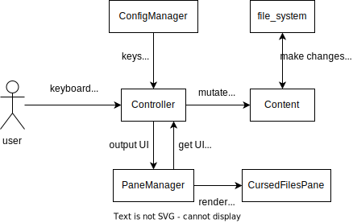

# Sharpshooter 

Minimal file manager in the terminal.

Single-key hotkeys for easy workflow.

Simple to configure and hack at.

*What this is not: complex, with many features, with thousands of commits, hard to get into, promising support for special encodings or alphabets, supporting extra features like bulk rename.*

# Features
- [x] configurable hotkeys
- [x] open terminal at current folder
- [x] open files with the appropriate application
- [x] toggle show/hide hidden files
- [x] make new folder
- [x] rename
- [x] delete
- [x] copy
- [x] paste
- [x] cut
- [x] easy extract/archive
- [ ] select multiple items

# Technologies

[curses](https://docs.python.org/3/library/curses.html)

[pathlib](https://docs.python.org/3/library/pathlib.html)

[configparser](https://docs.python.org/3/library/configparser.html)

[shutil](https://docs.python.org/3/library/shutil.html)

# Diagrams

# Inspired by
[ranger](https://ranger.github.io/)

[Midnight Comander](https://midnight-commander.org/)