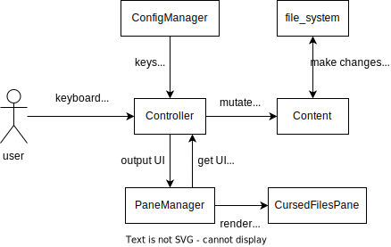

# Sharpshooter  [](https://github.com/vs-slavchev/sharpshooter/actions/workflows/ci.yml)

Minimal file manager in the terminal.

Single-key hotkeys for easy workflow.

Simple to configure and hack at.


*What this is not: complex, with many features, with thousands of commits, hard to get into, promising support for special encodings or alphabets, supporting extra features like bulk rename.*

# Single key actions
- [x] open terminal at current folder
- [x] archive/extract
- [x] make new folder
- [x] toggle hidden files visibility
- [x] rename
- [x] delete
- [x] undo delete
- [x] copy/cut
- [x] open file

## Features
- [x] select multiple files
- [x] configurable hotkeys

# Install

Requires Python 3 and [pipx](https://pipx.pypa.io) or [uv](https://docs.astral.sh/uv/).

**pipx**
```bash
pipx install git+https://github.com/vs-slavchev/sharpshooter.git
```

**uv**
```bash
uv tool install git+https://github.com/vs-slavchev/sharpshooter.git
```

**one-liner** (uses whichever of the above is available)
```bash
curl -fsSL https://vs-slavchev.github.io/sharpshooter/install.sh | bash
```

## Update

```bash
pipx upgrade sharpshooter   # or: uv tool upgrade sharpshooter
```

## Uninstall

```bash
pipx uninstall sharpshooter   # or: uv tool uninstall sharpshooter
```

## Configuration

Edit `~/.sharpshooter_config` to change hotkeys or settings:

```ini
[keys]
up = e
down = n
toggle_hotkeys = ?
# ... all other keys

[settings]
show_hidden = False
show_hotkeys = True
```

# Releasing a new version

1. Merge all changes to `master` and ensure CI is green.
2. Tag the commit:
   ```bash
   git tag v1.4.0
   git push origin v1.4.0
   ```
3. The [Release workflow](.github/workflows/release.yml) runs the tests and creates a GitHub Release with auto-generated notes.

# Technologies

[](https://www.python.org/)

[curses](https://docs.python.org/3/library/curses.html)

[configparser](https://docs.python.org/3/library/configparser.html)

[shutil](https://docs.python.org/3/library/shutil.html)

[logging](https://docs.python.org/3/library/logging.html)

# Block diagram


# Running in IntelliJ
- add `PYTHONUNBUFFERED=1` as env variable
- check Emulate terminal in output console

# Inspired by
[ranger](https://ranger.github.io/)

[Midnight Commander](https://midnight-commander.org/)
